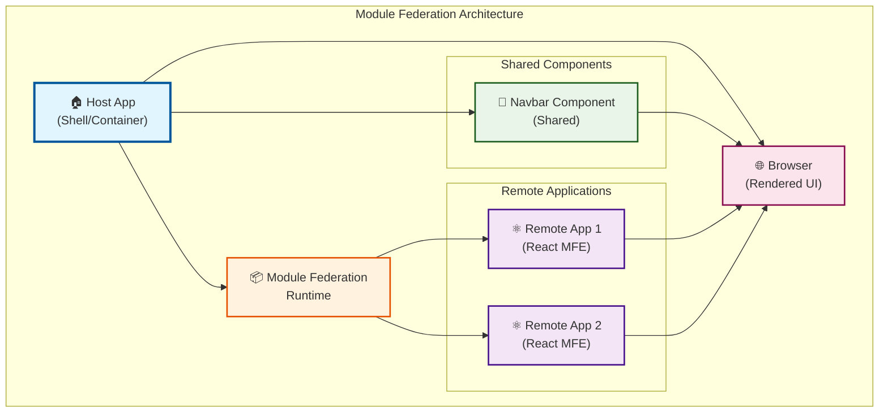

# 🏗️ Arquitectura de Microfrontends con Module Federation

> 📖 **¿Nuevo en Module Federation?** Lee nuestra **[Guía Paso a Paso: Crear Host-App desde Cero](./SETUP-GUIDE.md)** para aprender cómo construir todo el sistema desde el inicio con comandos detallados.
> 
> ⚛️ **¿Quieres crear aplicaciones remotas?** Consulta nuestra **[Guía para Crear Aplicaciones Remotas](./REMOTE-APP-GUIDE.md)** con ejemplos completos de microfrontends independientes.
> 
> 🔗 **¿Necesitas conectar apps existentes?** Revisa nuestra **[Guía de Integración: Conectar Remote Apps a Host](./INTEGRATION-GUIDE.md)** para aprender cómo integrar cualquier aplicación remota con tu host.

## 📋 Descripción General

Esta aplicación implementa una arquitectura de microfrontends utilizando **Webpack Module Federation**, permitiendo el desarrollo independiente y despliegue de múltiples aplicaciones React que se integran en una experiencia de usuario unificada.

## 🎯 Arquitectura del Sistema



## 🧩 Componentes de la Arquitectura

### 🏠 **Host App (Shell/Container)**
- **Función**: Aplicación principal que actúa como orquestador
- **Responsabilidades**:
  - Gestión de rutas principales
  - Integración de componentes compartidos
  - Carga de microfrontends remotos
  - Configuración global de la aplicación

### 🧭 **Navbar Component (Shared)**
- **Función**: Componente de navegación compartido
- **Características**:
  - Reutilizable entre todas las aplicaciones
  - Mantiene consistencia visual
  - Gestión de navegación global

### ⚛️ **Remote Apps (Microfrontends)**
- **Remote App 1**: Primera aplicación React independiente
- **Remote App 2**: Segunda aplicación React independiente
- **Características**:
  - Desarrollo independiente
  - Despliegue separado
  - Tecnologías específicas por equipo
  - Dominio de negocio específico

### 📦 **Module Federation Runtime**
- **Función**: Sistema de carga dinámica de módulos
- **Capacidades**:
  - Resolución de dependencias
  - Carga bajo demanda
  - Compartición de librerías
  - Gestión de versiones

---

## 📱 Aplicaciones del Sistema

### 🏠 **Shell (host-app) - Puerto 3000**

#### **Descripción**
La aplicación Shell es el **contenedor principal** que orquesta toda la experiencia del usuario. Actúa como el punto de entrada y gestiona la carga dinámica de los microfrontends remotos.

#### **Características Principales**
- **🧭 Navegación Global**: Navbar compartido con enlaces a todas las aplicaciones
- **🔄 Lazy Loading**: Carga bajo demanda de aplicaciones remotas
- **🛡️ Error Boundaries**: Manejo robusto de errores de aplicaciones remotas
- **🚦 Routing**: Gestión de rutas con React Router
- **📱 Responsive**: Diseño adaptable a todos los dispositivos

#### **Funcionalidades**
- **Página de Inicio**: Dashboard principal con acceso a todas las aplicaciones
- **Carga Dinámica**: Importación automática de Remote Apps según la ruta
- **Estados de Carga**: Indicadores visuales mientras se cargan los módulos remotos
- **Fallback**: Manejo graceful de errores cuando las apps remotas no están disponibles

#### **Estructura de Archivos**
```
host-app/
├── src/
│   ├── App.jsx          # Componente principal con routing
│   ├── App.css          # Estilos del shell
│   ├── bootstrap.js     # Inicialización de React
│   └── index.js         # Punto de entrada con patrón bootstrap
├── public/
│   └── index.html       # Template HTML
├── webpack.config.js    # Configuración Module Federation (consumer)
└── package.json         # Dependencias del shell
```

#### **Configuración Module Federation**
```javascript
// Consume aplicaciones remotas
remotes: {
  remoteApp1: 'remoteApp1@http://localhost:3001/remoteEntry.js',
  remoteApp2: 'remoteApp2@http://localhost:3002/remoteEntry.js',
}
```

---

### 📊 **Remote App 1 (Dashboard) - Puerto 3001**

#### **Descripción**
Aplicación especializada en **métricas y análisis empresarial**. Proporciona un dashboard completo con estadísticas en tiempo real y análisis de datos de negocio.

#### **Dominio de Negocio**
- **📈 Analytics**: Métricas de usuarios, ventas, pedidos e ingresos
- **📊 Business Intelligence**: Análisis de rendimiento empresarial
- **🎯 KPIs**: Indicadores clave de rendimiento
- **📱 Real-time Data**: Datos actualizados en tiempo real

#### **Características Específicas**
- **🔢 Estadísticas Animadas**: Contadores dinámicos con efectos visuales
- **📈 Tarjetas de Métricas**: Diseño modular para diferentes tipos de datos
- **🎨 Tema Profesional**: Paleta de colores enfocada en datos
- **⚡ Performance**: Optimizado para mostrar grandes volúmenes de información

#### **Funcionalidades Implementadas**
- **Dashboard Principal**: Vista general de métricas empresariales
- **Usuarios Activos**: Seguimiento de actividad de usuarios
- **Ventas Totales**: Monitoreo de performance de ventas
- **Gestión de Pedidos**: Control de órdenes y entregas
- **Análisis de Ingresos**: Seguimiento financiero detallado

#### **Componentes Principales**
```javascript
// Estructura de componentes
├── StatCard          # Tarjetas de estadísticas
├── MetricsGrid       # Grid de métricas principales  
├── FeatureCards      # Características destacadas
└── AnimatedCounters  # Contadores con animaciones
```

#### **Estilos y Diseño**
- **🎨 Color Scheme**: Azules y grises profesionales
- **📱 Grid Layout**: Diseño responsivo con CSS Grid
- **✨ Micro-animations**: Efectos sutiles en hover y carga
- **📊 Data Visualization**: Elementos visuales para datos

---

### 👥 **Remote App 2 (Gestión de Usuarios) - Puerto 3002**

#### **Descripción**
Sistema completo de **administración y gestión de usuarios**. Proporciona herramientas para el control, búsqueda y administración de usuarios del sistema.

#### **Dominio de Negocio**
- **👤 User Management**: Gestión completa de usuarios
- **🔍 Search & Filter**: Búsqueda y filtrado avanzado
- **👥 Role Management**: Gestión de roles y permisos
- **📊 User Analytics**: Estadísticas de usuarios

#### **Características Específicas**
- **🔍 Búsqueda en Tiempo Real**: Filtrado instantáneo por nombre y email
- **🏷️ Sistema de Roles**: Admin, Editor, Viewer con colores distintivos
- **🔄 Estados de Usuario**: Activo/Inactivo con indicadores visuales
- **📱 Cards Layout**: Diseño de tarjetas para mejor UX

#### **Funcionalidades Implementadas**
- **Lista de Usuarios**: Visualización completa con avatars y metadata
- **Búsqueda Inteligente**: Filtrado por nombre, email y otros campos
- **Filtros por Estado**: Todos, Activos, Inactivos
- **Gestión de Roles**: Visualización clara de permisos
- **Acciones Rápidas**: Botones de edición y eliminación
- **Estadísticas**: Resumen de usuarios por estado

#### **Sistema de Datos Mock**
```javascript
// Estructura de usuario
{
  id: number,
  name: string,
  email: string,
  role: 'Admin' | 'Editor' | 'Viewer',
  status: 'active' | 'inactive',
  avatar: string (emoji)
}
```

#### **Componentes Principales**
```javascript
// Estructura de componentes
├── UserCard         # Tarjeta individual de usuario
├── SearchBox        # Componente de búsqueda
├── FilterSelect     # Selector de filtros
├── UserGrid         # Grid responsivo de usuarios
├── StatsPanel       # Panel de estadísticas
└── ActionButtons    # Botones de acción (editar/eliminar)
```

#### **Estilos y UX**
- **🎨 Color Coding**: Roles con colores específicos
- **🟢 Status Indicators**: Verde para activo, rojo para inactivo
- **📱 Responsive Grid**: Adaptable a diferentes pantallas
- **✨ Hover Effects**: Micro-interactions en tarjetas
- **🔍 Search UX**: Feedback visual en búsquedas sin resultados

---

## 🔗 **Integración entre Aplicaciones**

### **Comunicación Host ↔ Remotes**
- **Carga Dinámica**: El shell carga las apps bajo demanda
- **Shared Dependencies**: React y React-DOM compartidos
- **Error Isolation**: Errores en remotes no afectan al shell
- **Independent Updates**: Cada app se puede actualizar independientemente

### **Flujo de Navegación**
1. **Usuario accede al Shell** (localhost:3000)
2. **Navegación por Navbar** a aplicaciones específicas
3. **Lazy Loading** de la aplicación solicitada
4. **Renderizado** dentro del contenedor del shell
5. **Mantenimiento del contexto** de navegación global

## 🔄 Flujo de Trabajo

1. **Inicialización**: El Host App se carga en el navegador
2. **Configuración**: Module Federation Runtime se inicializa
3. **Carga de Navbar**: Se renderiza el componente compartido
4. **Carga Dinámica**: Los Remote Apps se cargan según la navegación
5. **Integración**: Todo se integra en una experiencia unificada

## ✅ Ventajas de esta Arquitectura

- **🔄 Desarrollo Independiente**: Cada equipo puede trabajar en su microfrontend
- **🚀 Despliegues Separados**: Actualizaciones sin afectar otras partes
- **♻️ Reutilización**: Componentes compartidos entre aplicaciones
- **📈 Escalabilidad**: Fácil adición de nuevos microfrontends
- **🛠️ Tecnología Flexible**: Diferentes versiones de React por aplicación
- **⚡ Performance**: Carga bajo demanda de recursos

## 📁 Estructura de Proyecto Sugerida

```
module-federation-app/
├── host-app/                 # Aplicación Host
│   ├── src/
│   │   ├── App.jsx
│   │   ├── index.js
│   │   └── bootstrap.js
│   ├── webpack.config.js
│   └── package.json
├── shared-components/        # Componentes Compartidos
│   ├── src/
│   │   └── Navbar/
│   ├── webpack.config.js
│   └── package.json
├── remote-app-1/            # Primer Microfrontend
│   ├── src/
│   │   ├── App.jsx
│   │   └── index.js
│   ├── webpack.config.js
│   └── package.json
├── remote-app-2/            # Segundo Microfrontend
│   ├── src/
│   │   ├── App.jsx
│   │   └── index.js
│   ├── webpack.config.js
│   └── package.json
└── README.md
```

## ⚙️ Configuración Básica

### Host App - webpack.config.js
```javascript
const ModuleFederationPlugin = require('@module-federation/webpack');

module.exports = {
  mode: 'development',
  devServer: {
    port: 3000,
  },
  plugins: [
    new ModuleFederationPlugin({
      name: 'host',
      remotes: {
        remoteApp1: 'remoteApp1@http://localhost:3001/remoteEntry.js',
        remoteApp2: 'remoteApp2@http://localhost:3002/remoteEntry.js',
        sharedComponents: 'sharedComponents@http://localhost:3003/remoteEntry.js',
      },
      shared: {
        react: { singleton: true },
        'react-dom': { singleton: true },
      },
    }),
  ],
};
```

### Remote App - webpack.config.js
```javascript
const ModuleFederationPlugin = require('@module-federation/webpack');

module.exports = {
  mode: 'development',
  devServer: {
    port: 3001, // 3002 para la segunda app
  },
  plugins: [
    new ModuleFederationPlugin({
      name: 'remoteApp1', // remoteApp2 para la segunda
      filename: 'remoteEntry.js',
      exposes: {
        './App': './src/App',
      },
      shared: {
        react: { singleton: true },
        'react-dom': { singleton: true },
      },
    }),
  ],
};
```

## 🚀 Comandos de Desarrollo

```bash
# Instalar dependencias en todas las apps
npm install

# Ejecutar todas las aplicaciones en paralelo
npm run dev

# O ejecutar individualmente:
npm run dev:host        # Puerto 3000
npm run dev:shared      # Puerto 3003
npm run dev:remote1     # Puerto 3001
npm run dev:remote2     # Puerto 3002
```

## 📚 Tecnologías Utilizadas

- **React**: Framework de UI
- **Webpack 5**: Bundler con Module Federation
- **Module Federation**: Plugin para microfrontends
- **React Router**: Navegación entre rutas
- **Styled Components / CSS Modules**: Estilos encapsulados

## 🔧 Próximos Pasos

1. **Configurar el entorno de desarrollo**
2. **Implementar el Host App**
3. **Crear el componente Navbar compartido**
4. **Desarrollar los Remote Apps**
5. **Configurar CI/CD para despliegues independientes**
6. **Implementar tests de integración**

## 🤝 Contribución

1. Fork el proyecto
2. Crea una rama para tu feature (`git checkout -b feature/AmazingFeature`)
3. Commit tus cambios (`git commit -m 'Add some AmazingFeature'`)
4. Push a la rama (`git push origin feature/AmazingFeature`)
5. Abre un Pull Request

## 📄 Licencia

Este proyecto está bajo la Licencia MIT - ver el archivo [LICENSE.md](LICENSE.md) para más detalles.

---

⚡ **¡Construyamos el futuro de las aplicaciones modulares!** ⚡ 